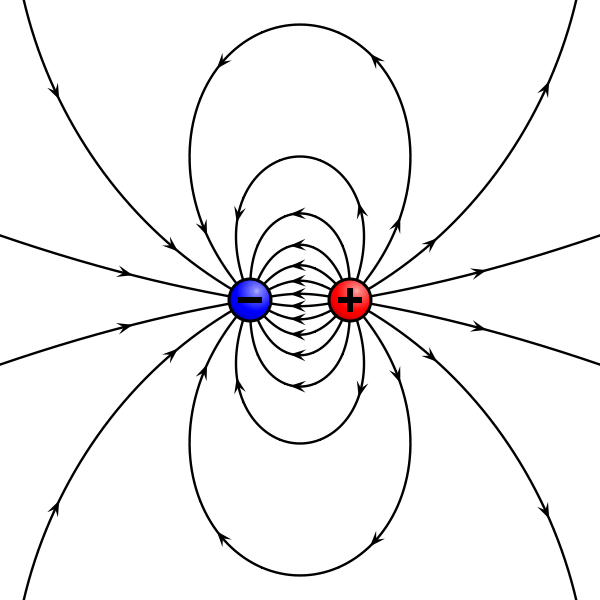
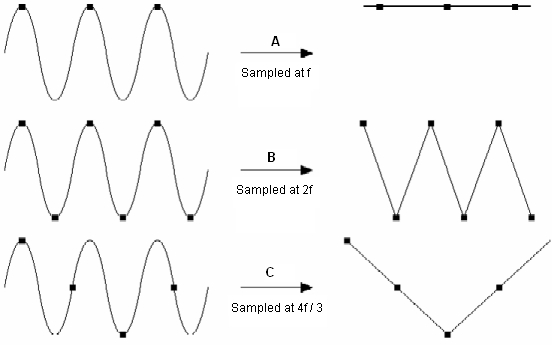
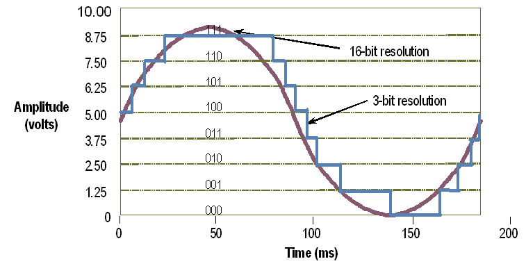
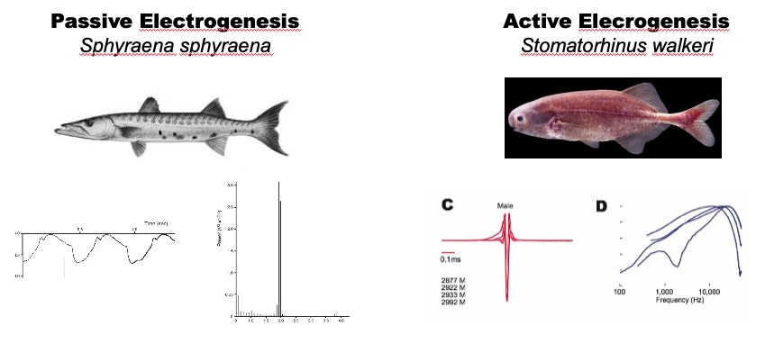

# EODRecorder2
Written by Jason Gallant, includes modified code from B. Scott Jackson for EOD reading

### About this Software
This is the new Gallant lab standard EOD recording software, which is capable of using either an audio interface or a National Instruments board for EOD recording.

#### To install:
1. Clone repo onto your computer
2. Install Matlab 2019a or higher & Data Acquisition Toolbox
3. Install support package for National Instruments (if required)
4. Install support package for sound card

> To do this, open Matlab 2019a or higher, click on Home > Add-Ons>Manage Add-Ons.
Check if you have these:
- Data Acquisition Toolbox Support Package for National Instruments Ni-DAQmx Devices
- Data Acquisition Toolbox Support Package for Windows Sound Cards

> If you don’t have them, go to Add-Ons> Get Add-Ons, search for them and install them

5. Run the eodrecorder2.mlapp binary
6. To install shortcut into Matlab 'Apps' tab, run the Eod Recorder.mlappinstall file

#### Output files:
This software introduces a few internal file name conventions:

- **.eod**	   - Legacy Hopkins Lab Binary EOD Formatted File (Updated to Version 2).  Multiple Recordings per EOD.  Preliminary analysis reveals that these are not as space efficient at MAT files.

- **.mat**  Matlab formatted recording of EOD.  Multiple Recordings Per EOD inside the 'eod' structure.

- **.leod.mat**  - long recording of EOD.  One recording per file.

#### Working with output files:
To open a .leod or .mat file:
eod=load('Desktop\TEST2019\mytest.leod.mat')

To open a .eod file:

[eodwave, info, infoText] = ReadEODFile(filename, numToRead)

### How to Record EODs

#### Highly recommended background reading:
- <http://nelson.beckman.illinois.edu/courses/physl416/electrophys.pdf>
- <https://mdc.custhelp.com/euf/assets/content/Axon%20Guide%203rd%20edition.pdf>
- <https://www.ncbi.nlm.nih.gov/pubmed/11248340>
- <http://citeseerx.ist.psu.edu/viewdoc/download?doi=10.1.1.560.5833&rep=rep1&type=pdf>
- <http://mormyrids.myspecies.info/en/node/484>

### 1. What We’re Trying to Measure

The electrostatic fields produced by weakly electric fish are caused by the synchronous discharge of **action potentials** made by the **electrocytes** that compose the **electric organ**. The electric organ effectively (though not *exactly*) acts as a simple dipole, where the separation of positive and negative charges is separated by a distance that is equal to the length of the electric organ.

When we place our recording electrodes in a conductive medium (water) in a tank with electric fish, our electrodes measure the difference in potential between positive and negative electrodes in volts over time. While this may seem simple, these pages are intended to impress the reader with just how complicated these measurements are. Several important considerations need to be made in order to make an effective EOD recording.

### 2. How We Measure It

Our recording electrodes typically are composed of three wires. In neurophysiology parlance, our standard EOD recordings are **bipolar** or **differential recordings**. With our standard electrodes, there are three connections to water with an electric fish: the **positive** electrode (red lead; sometimes called the signal electrode), the **negative** electrode (black lead, sometimes called the indifferent electrode), and the **ground** electrode (clear lead, sometimes referred to as the preparation ground). By convention, we always record EOD waveforms by placing the red lead at the anterior (head) end of the animal and the indifferent electrode at the tail end of the animal. The ground electrode should be placed some distance away.

These electrodes are then connected to an amplifier, typically the BMA-200 but sometimes the AM Systems XXYY. We almost always make *differential mode* recordings, which amplifies the difference between two inputs (in our case, between the positive and negative electrodes).

Finally, the preparation ground wire, which is placed in the recording tank somewhat far from the recording provides a “shunt” to ground for stray electromagnetic fields induced in the recording setup. More on this in a moment.

We are measuring the potential difference between two locations in the electric field. This is synonymous with measuring the change in “height” on a topological relief map. In this example, we represent changes in gravitational potential (height) by the density of lines on a 2D topological map. Similar to this analogy, the imaginary electric field lines created by a dipole represent the change in potential between two points in a space.

*Electrode Position:*

Because of the manner in which we amplify signals (differential), and the fact that we are making ‘extracellular’ recordings in a uniform field created by a dipole, the following is likely to be true: a positive and negative electrode near to each other will measure a very ***small*** potential difference compared to a positive and negative electrode very far apart from each other in the same field, which will measure a very ***large*** potential difference. Thus, the size of the electrode should be selected based on the size of the fish, and the conductivity of the water you are recording in.

*Clipping*:

The amplifier has a maximum output range (BMA-200 is +/6V). If you amplify an input signal beyond this range, it will become clipped. Clipped EODs are not useful. Be sure not to amplify beyond this range.

*Data Acquisition*:

The voltages coming out of the amplifier are an analog signal: the voltage changes continuously over time. In order for a computer to record and represent this information in memory, it must be made into a discrete number of bins, and voltage values in those bins is stored as a digital value (Analog-to-Digital Conversion). This is a common operation in consumer electronics, and is done by an A/D converter. A sound card is a great example of this type of device. When performing an EOD recording, there are two considerations one must make about selecting an A/D Converter. The first is ****sample rate****, the second is ****resolution.****

*Sample Rate:*

Let’s consider a simple analog signal, a sine wave at 10hz. If our analog to digital converter sampled at 10hz, we would represent the waveform very poorly (see figure). If we sample at 20hz, it would improve. If we had ‘infinite’ samples, we would have a perfect representation of the waveform. Of course, every additional sampling point increases the amount of memory necessary for storage. So, we typically trade between a good sampling rate and a small file size. We also ‘optimize’ the sampling rate for signal processing (if using the TDT system, lower number of samples = faster operation) and for the duration of the EOD we are trying to record. Extremely brief EODs would not be well represented by a sampling rate of only 100,000hz. By increasing the sample rate to 250,000hz, we encode the EOD much better.

*Resolution*:

Another issue we must consider is resolution. A/D converters have a range associated with them (our NI-DAQ boards typically have +/-10V range). The A/D converter converts voltage readings (taken at the sampling rate) and converts them to binary values using a fixed number of bits, which is referred to as the *resolution*. Our A/D Converters have 16 bits of resolution typically, so the maximum number of values we can encode with 16 bits of resolution is:

2^16^ = 65536 values.

If we then divide our 20V range by this number of values, we see that we have:

(20/65536)\*1000 = 0.3 mV per “step”

That means that our ability to resolve a voltage difference of &lt;0.3mV would be ambiguous using a 16 bit recorder. This may be more intuitive visually, considering the difference between a 3 bit A/D conversion and a 16 bit A/D conversion of the same sine wave.

Therefore, to maximize vertical resolution, it is prudent to record an EOD with the maximum possible amplitude without clipping to preserve the vertical resolution.

*Noise:*

The most common source of noise is from stray electromagnetic fields (this can be the lights, unshielded cables, moving metals, etc). To minimize noise in the setup, we utilize two features in our recording setup. First is the use of a differential amplifier. This type of amplifier design typically has the feature of *common mode rejection*, meaning that signals recorded on both the positive and negative in the same phase and time are “filtered out” providing a clean(er) signal. Another way of preventing noise is to use cables with foil shielding-- this prevents the fields induced by electrons moving from wires in your setup to influence your recording. If the environment is extremely noisy, this principle can be extended by using foil to insulate the recording apparatus, or using tin foil.

Note that ground-loop noise arises when shielding is grounded at more than one place. Magnetic fields may induce currents in this loop. Ground loops can also result from unconnected (or poorly connected) wires, particularly long ones. These act as antennae for noise. Do your best to use the shortest possible connections between devices, and remove stray wires, and inspect the grounding of shielding when diagnosing a noisy recording.

*AC/DC Coupling:*

Bioelectric signals are typically the result of passive processes (heartbeat, brain function, gill transport). Any of these voltage signals can be represented in the time domain (e.g. voltage over time) or in the frequency domain, by decomposing the signal into a histogram of frequencies. This concept is known as a Fourier transform. Let’s look at the bioelectric signals generated by a normal fish and electric fish, and their corresponding Fourier transforms.

In the case of passive electric fields, notice that the peak frequency is about 20hz. Contrast this with an electric fish EOD. We can tell that the signal is much faster than the passive signal. In the frequency domain, this translates into a much higher peak frequency 10,000hz.

**DC amplifiers** have the capability of recording frequencies at these low ranges all the way up to these very high frequencies without trouble in theory. However, DC signals are difficult to measure, especially using metal electrodes in water. As we learned in high school chemistry metals in water create a battery. This creates a **DC offset**, or an additional potential on top of the signal we wish to measure. By “chloriding” silver wire we can reduce the frequency of this fluctuation and produce a counter potential in the amplifier to “balance” this signal and measure the true DC component made by the fish. In practice, this requires very careful and close attention, and constant adjustment to the DC balance knob. Sometimes, it’s impossible to do this effectively (particularly in field conditions).

Alternatively, notice that very little of the information of the EOD is in the DC range 0-20hz. We could simply remove this by using a capacitor in our circuit, which is referred to **AC Coupling**. This causes minimal distortion in the EOD unless the duration is very long. This removes the DC component of the waveform, and prevents the drift, but degrading our signal somewhat. AC coupling can be introduced into the circuit at one or two locations-- one is at the amplifier, the other is at the A/D converter. Sound cards (because they are concerned mainly with sound) always AC couple voltage signals (this also prevents damage to your computer and also removes potentially distorting voltages that may corrupt audio recordings). National Instruments boards typically do not do this.

*Calibration:*

EOD amplitude (and duration) are sensitive to changes in water temperature and conductivity and even water level. You MUST record both the conductivity and the temperature with every recording. EODs can later be temperature corrected (see Gallant et al. 2011) for the procedure. Amplitude changes, however, can only be compared between calibrated recordings.

*Why Calibrate?*

With arbitrarily positioned electrodes and differences in recording setups, absolute voltage produced by an electric fish is essentially meaningless without calibration.

*When Should You Calibrate? (Stolen from Phil Stoddard’s Lab)*

-   When you are starting a new experiment

-   When you change either the conductivity or water levels of an existing experiment.

-   When you put in new fish into an existing experiment (increasing sample size)

-   Anytime you change anything about the physical aspects of the tanks (i.e., electrodes, ceramic tube, mesh partitions) that would require taking some aspect of the tank apart. This includes moving fish between experimental apparatus.

-   Anytime the electrical properties of the recording are changed (new A/D converter, different gain, different amplifier, use of a voltage divider).

Our simple form of calibration follows the methods used by Michael Markham, Phil Stoddard and Cheryl Franchina. The concept is quite simple:

a.  Using a calibration wand, we simulate an electric fish by playing a Sine Wave on Channel A at a fixed amplitude, placed at/near where the fish will be discharging.

b.  On the calibration wand, we record Channel A signal from a known, fixed distance away (X cm) on Channel B.

c.  We record this signal simultaneously from our recording electrode setup (Channel C).

d.  We divide the ratio of signals obtained from the two recording electrodes (Channel C/ Channel B**). This gives us the amplitude of EOD signal at distance X in mV cm^-1^**.

###  3. A Practical Guide to EOD Recording

So, measuring an EOD requires balancing a number of considerations. Ideally, we would want a high resolution, high sampling rate, DC balanced signal. Given conditions, time, and recording equipment, checking all of these boxes is sometimes not possible.

1.  Consider What Equipment you need

a.  **Decide whether DC or AC coupling is sufficient for your purposes.**

  This determines the recording hardware. AC coupling is compatible with sound cards, provided that there is sufficient sampling rate. **If DC recording is needed, you cannot use a sound card.**

b. **Decide on the sampling rate necessary.**

  How fast is the EOD you are hoping to measure? Check with an oscilloscope if you need to figure this out. Standard Mormyrid EODs are well encoded by 100khz sampling rate. Very brief species (*Petrocephalus*, *Campylomormyrus* some *Paramormyrops*) require a higher sampling rate. Standard laptops can easily meet the 100khz sampling rate, or higher, but require a microphone adapter for your amplifier. We have the **Steinberg UR22**, which has a very high sample rate (but is a sound card, so performs AC coupling), and has snap-in XLR connectors and performs some amplification. If you need very high sampling rate and DC, you’ll need to use one of the National Instruments boards **(NI-6211 or 62216)**

c.  **Will you compare amplitudes of signals across recordings?**

  If so, you’ll need the following additional equipment: *a stimulus isolator*, A/D converter with two recording and one output channel (typically NI-DAQ, but also RM1 or external sound card).

2.  Set up your recording

a.  **Set up equipment**

Find a quiet location in the laboratory with minimum disturbance. Set up your electrodes, amplifier, and A/D converter. If you’d like to keep your electrodes in a fixed position, and this gives EODs that are too large in amplitude, you can use a voltage divider in line (black boxes with volume knobs). Plug the USB cord into a Windows-compatible laptop.

*Note: you should ALWAYS use an oscilloscope to monitor the EOD signals that you are wishing to record. If you haven’t used an oscilloscope, you aren’t doing it right! Once you are confident that the signal is correct, you can unplug it to minimize noise, if necessary.*

c.  **Record EODs **

  i.  Start the recording software & setup the correct configuration of hardware in the setup tab & begin recording.
